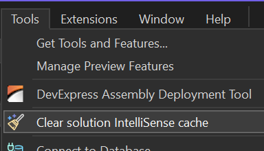
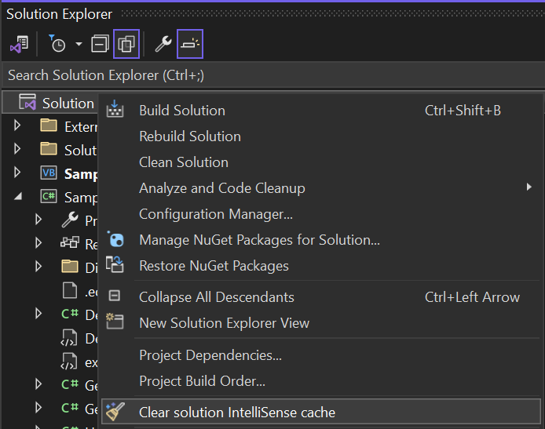
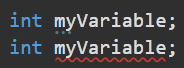
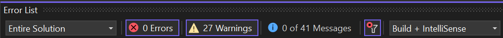
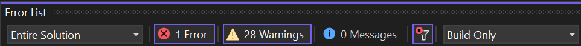

# Clear Solution IntelliSense Cache for Visual Studio

This extension clears the solution IntelliSense cache to fix issues with broken IntelliSense at design time, such as false or missing compile errors, etc.

After installing, a new **Clear solution IntelliSense cache** menu item is created under the Tools menu

and also under the solution node context menu in solution explorer.

When you invoke the command, it will clear the IntelliSense cache and reload the solution.

## Why to clear the IntelliSense cache

A simple answer is, because it gets broken sometimes.

It surely happened to many of us. All of a sudden, IntelliSense is no longer working as expected. The most apparent sign of this is that you no longer see the compiler error underlines in your code at design time. For example, the duplicate declaration error below is not reported:

However, if you build the project, you get the errors in the output window. Moreover, these errors are not necessarily listed in the Error List window. My experience is that if you display them for Build + IntelliSense (which is probably the default setting), the build errors are not listed.

However, if you switch to Build Only, the error is listed after the build has finished unsuccessfully.

The situation may be also quite opposite. There is no error in the code and the project build fine. But IntelliSense keeps displaying the compile errors.

## Solutions

Just some technical details how the problem could be solved manually and how it's fixed with this extension.

### Solution 1
Restarting Visual Studio doesn't help. We need to delete the wrong IntelliSense cache. It's stored in the .vs folder in the solution root folder. The easiest way is to close the solution and manually delete the .vs folder. This will help. But it erases all your user-specific settings, such as open documents, bookmarks, breakpoints, configuration, etc.

### Solution 2
A less invasive solution would be to delete only the .suo file inside the .vs folder. But still, this file contains many other settings that will be lost along with the IntelliSence cache data. 

And what's worse, it doesn't help in some cases. For example, I've encountered the following situation. I deleted the .suo file. After I opened the solution, IntelliSence was working fine. But this deletion has reset my other settings, including Configuration+platform. It reset my solution configuration to Debug|Mixed platforms. This is not what I wanted and I changed it to Debug|AnyCPU. And guess what… The IntelliSense problem appeared again. But only in the  Debug|AnyCPU. If I switched to Debug|Mixed platforms or Release|AnyCPU, everything was working fine. But there was no way to reset the wrong cache and keep the solution in Debug|AnyCPU.

### Solution 3
The only solution is to delete only the IntelliSense data from the .suo file while keeping all other settings. The [solution user options (.suo) file](https://learn.microsoft.com/en-us/visualstudio/extensibility/internals/solution-user-options-dot-suo-file?view=vs-2022) is a structured storage, or [compound, file stored in a binary format](https://learn.microsoft.com/en-us/openspecs/windows_protocols/ms-cfb/53989ce4-7b05-4f8d-829b-d08d6148375b). It contains multiple streams with unique names. Our goal is to delete just those streams that contain the wrong data and keep all the others. And that's exactly what this VSIX extension does.
